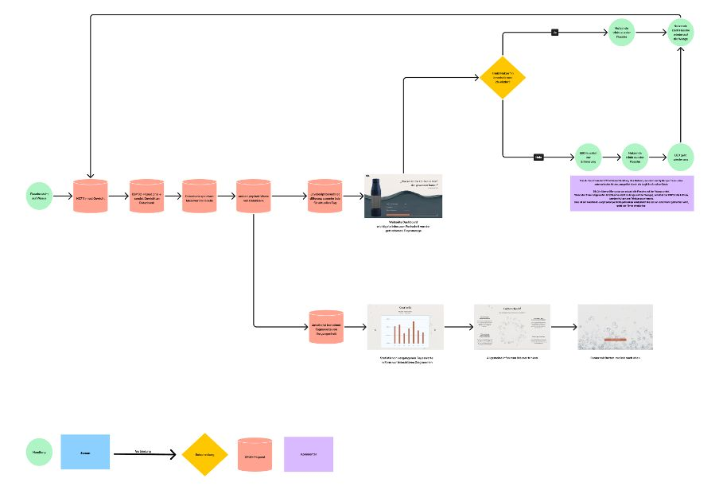

# *Dokumentation Stefanie Hasler und Lucia Schnyder, mmp23b*

## *Komponenten:*

- Arduino 
- HX711-Verstärkermodul
- Wägezelle (für 10 kg)
- Wasserflasche
- Jumper-Kabel
- USB‑Kabel für Arduino
- Halterung

## *Schritt für Schritt:*

1. Die Wägezelle zwischen zwei festen Platten befestigen.
2. Gemäss Steckschema alles zusammenbauen ([Siehe Steckschema])(#steckschema)
3. Arduino öffnen und mit Microboard verbinden
4. Bei Arduino IDE → Sketch → Installiere Library → HX711 Arduino Library" by Bogdan Necula
5. Richtiger Port und Board auswählen bei Arduino (Unter Tools)
6. Kalibrierung durchführen (Unter Serial Monitor kontrollieren, was rauskommt). Die Kalibrierung ist nötig, damit die Sensor Sprache in Gramm übersetzt werden kann. 
7. Beispielcode oder eigener Code schreiben. Bei uns mussten wir schauen, dass alle Werte im Serial Monitor angezeigt wurden und dann aber nur der Durchschnittswert in die Datenbank geschickt wird. Bei den Werten haben wir auch geschaut, dass die ersten 5 Werte ignoriert werden, da man die Flasche noch auf die Waage stellt. Auch negative Werte werden ignoriert. 
8. Erstelle in phpMy Admin eine MySQL Tabelle. PhpMy Admin ist ein Verwaltungstool für Datenbanken, es zeigt die gespeicherten Werte.
9. Stelle sicher das auf dem Arduino Code eine WLAN Verbindung hergestellt wurde. Die WLAN Verbindung ist nötig, damit der Microcontroller (ESP32) die gemessenen Daten an einen Server oder ins Internet senden kann. ESP32 misst das Gewicht und sendet die Daten.
10. Nachdem der Code fertig geschrieben wurde, bei Arduino oben links Upload drücken
11. Nach Upload bei Serial Monitor kontrollieren ob gewünschte Daten rauskommen. 

## *Flussdiagramm*

## *Komponentenplan*

In unserem Projekt haben wir folgende Bauteile verwendet:

| *Komponente*        |              *Beschreibung*                                                   |
|-----------------------|---------------------------------------------------------------------|
| ESP32-C6-N8           | Microcontroller-Board zur Steuerung und Kommunikation              |
| Steckplatine          | Steckboard                                                         |
| Wägezelle             | Sensor zur Gewichtserfassung                                       |
| SEN-HX711 Modul       | Verstärker und ADC zur Auswertung der Wägezelle                    |
| LED-Ring WS2812B      | RGB-LEDs zur Visualisierung der gemessenen Werte                   |
| 390-Ohm-Widerstand    | Schutzwiderstand für den Neopixel-Datenpin                         |
| 1000 µF Kondensator    | Glättungskondensator für die Spannungsversorgung der LEDs         |
| Jumper-Kabel          | Verbindet die einzelnen Bauteile auf dem Microcontroller-Board

Die Farben der Jumperkabel sind wie folgt kodiert:

- Rot: Versorgungsspannung
- Schwarz: GND
- Gelb: Datenleitungen

Besondere Elemente:

- Kondensator (1000 µF): Zwischen 5V und GND am Neopixel-Ring

- 390-Ohm-Widerstand: In der Datenleitung zwischen ESP32 und Neopixel-Ring

## *Verbindungen der Komponenten / Kommunikationsschema*

| *Verbindung*            | *Von*                          | *Nach*                         | *Funktion*                                      |
|---------------------------|----------------------------------|----------------------------------|--------------------------------------------------|
| HX711 GND                 | Masseleiste (GND)                | HX711 GND                        | Masse                                             |
| HX711 DT (Data)           | ESP32 GPIO 6                     | HX711 DT                         | Dateneingang der Wägezelle                        |
| HX711 SCK (Clock)         | ESP32 GPIO 7                     | HX711 SCK                        | Taktleitung der Wägezelle                         |
| HX711 VCC                 | positive Stromversorgungsleiste | HX711 VCC                        | Stromversorgung                                   |
| LED-Ring Data In          | ESP32 GPIO 2                     | WS2812B Data In                  | Steuerung der RGB-LEDs                           |
| LED-Ring VCC              | positive Stromversorgungsleiste | WS2812B VCC                      | Stromversorgung der LEDs                          |
| LED-Ring GND              | Masseleiste (GND)                | WS2812B GND                      | Masse                                             |
| 390-Ohm-Widerstand        | In Reihe zur LED-Data-Leitung    |                                  | Schutz des Datenpins                             |
| 1000 µF Kondensator       | Zwischen 5V und GND              |                                  | Glättet Spannungsschwankungen für die LEDs        |
| Stromversorgungsleisten   | ESP32 5V- und GND-Pins           | Stromschienen des Breadboards    | Versorgung aller Komponenten                      |

## *Steckschema*

Der Aufbau zeigt:
Die Wägezelle ist mit dem HX711 verbunden.

Das HX711-Modul ist mit dem ESP32 verbunden.

Der Neopixel-Ring wird direkt vom ESP32 gesteuert und mit Strom versorgt.

Die gemeinsame Masseverbindung (GND) ist für alle Komponenten verbunden.

## *Bilder*

## *Bericht zum Umsetzungsprozess*

Entwicklungsprozess: Wir kamen recht schnell auf die Idee eine Flasche zu gestalten, die das Trinkverhalten der Nutzenden aufzeigt, und als Erinnerung dienen soll. Da es viele älteren Menschen schwerfällt, sich an das Trinken zu erinnern.

verworfene Lösungsansätze: Wir wollten zuerst die Trinkmenge mit einem Wasserstand Sensor ermitteln. Da dieser doch für eine Wasserflasche zu kurz ist, mussten wir auf die Waage umstellen. 

Designentscheidungen & Inspirationen: 
Ein Design, das für die Zielgruppe 50+ passt.
Das Design soll ins Auge stechen und einen Wiedererkennungswert haben.
Die Wasser Symbole (Welle und Bubbles) weisen klar auf das Thema Wasser/Trinken hin.
Die Farbe rot beim Balken zeigt auf, dass man wieder trinken sollte. 
Soll etwas schicker und moderner herkommen, aufgrund der Fonts und Farbentscheidungen.

Fehlschläge und Umplanung: Wir wollten am Anfang noch ein Art Ladevorgang machen, der aufzeigt, dass die Flasche verbunden wird. Dies macht jedoch nur Sinn, wenn es mehrere Flaschen gäbe und jeder Nutzende die Flasche mit der App verbinden müsste, um das Trinkverhalten zu sehen.

Challenges: Es war etwas schwierig, bei Arduino den passenden float calibration factor ausfindig zu machen. Da uns Arduion zwar schon Werte gab, diese jedoch nicht in Gramm angegeben wurden. Nach mehrfachen ausprobieren mit der Flasche und dem Anpassen des float calibratoin factor Wert kamen wir schliesslich auf einen recht akkuraten Wert. 

Lerneffekt: Wir haben viel über die Physical Computing Welt gelernt, da wir beide noch keine Erfahrungen sammeln durften. Es war auch sehr spannend, direkt auf dem Microboard verschiedene Sensoren zu testen und zu merken, dass es funktioniert. 

Known Bugs: Die Waage war in der Testphase nicht befestigt, dadurch mussten wir sie immer per Hand befestigen. Dies machte natürlich die ganzen Messungen etwas ungenau und mühsam. 

Planung: Wir haben zuerst uns für das Thema entschieden und dann direkt die Waage bestellt, da diese nicht im Kit enthalten war. Diese kam etwa nach einer Woche an. Leider stellte sich heraus, dass die Kabel der Waage noch nicht gelötet waren. Unser Dozent Jasper war so lieb und übernahm diese Aufgabe, damit sie für den nächsten Tag fertig war. Jedoch verloren wir dadurch Zeit, weil wir auf die fertige Waage warten mussten.

Aufgabenverteilung: 
- Umsetzungsplanung: Teamarbeit
- Zusammensetzen der Komponenten: Teamarbeit
- Verkabelung: Teamarbeit
- Arduino-Programmierung: Teamarbeit
- UX-Design: Stef
- Backend: Lutz
- Frontend: Teamarbeit

Hilfsmittel: Wir haben folgende Hilfsmittel gebraucht: ChatGPT

## *Video Link:* 
https://drive.google.com/file/d/1raiZ4i1gOnnYychcfNYPTXt8SPtsB5dY/view?usp=sharing

## *Arduino Code*

// =========================== Bibliotheken einbinden ===============================
#include <WiFi.h>
#include <HTTPClient.h>
#include <Arduino_JSON.h>
#include "HX711.h"
#include <Adafruit_NeoPixel.h>

// =========================== WLAN-Zugangsdaten ===============================
const char* ssid     = "tinkergarden";
const char* pass     = "strenggeheim";

// =========================== Server-URL ===============================
const char* serverURL = "https://im4.luciaschnyder.ch/load.php";

// =========================== Waage Setup ===============================
#define HX711_DT  6
#define HX711_SCK 7
HX711 scale;
float calibration_factor = -195.72;

// =========================== LED Setup ===============================
#define LED_PIN 2
#define NUM_PIXELS 12
#define BRIGHTNESS 100
Adafruit_NeoPixel strip = Adafruit_NeoPixel(NUM_PIXELS, LED_PIN, NEO_GRB + NEO_KHZ800);

// =========================== Schwellen ===============================
float gewichtGrenze = 500.0;
float detectionThreshold = 0.1;  // Ab wann wird Flasche erkannt (> 0.1g)
int minValidMessungen = 5;        // Mindestanzahl an Messwerten für gültige Messung

// =========================== Flaschen-Logik ===============================
bool flascheErkannt = false;
unsigned long letzteMessung = 0;
const unsigned long checkIntervall = 1000;  // alle 1 Sekunde prüfen

// Für Mittelwertberechnung
float gewichtSumme = 0.0;
int anzahlMesswerte = 0;

// =========================== Zusätzliche Variablen für LED-Erinnerung ===============================
bool ledErinnerungAktiv = false;
unsigned long flascheSeit = 0;
const unsigned long LED_ERINNERUNG_DAUER = 30 * 1000UL;  // 30 Sekunden

// =========================== SETUP ===============================
void setup() {
  Serial.begin(115200);
  WiFi.begin(ssid, pass);
  Serial.print("Verbinde mit WLAN");
  while (WiFi.status() != WL_CONNECTED) {
    delay(500);
    Serial.print(".");
  }
  Serial.println("\nWLAN verbunden!");
  Serial.println(WiFi.localIP());

  scale.begin(HX711_DT, HX711_SCK);
  scale.set_scale(calibration_factor);
  scale.tare();
  Serial.println("Waage bereit!");

  strip.begin();
  strip.setBrightness(BRIGHTNESS);
  strip.show();
}

// =========================== LOOP ===============================
void loop() {
  unsigned long jetzt = millis();

  if (jetzt - letzteMessung >= checkIntervall) {
    letzteMessung = jetzt;

    float gewicht = scale.get_units(3);  // 3 Messwerte mitteln
    Serial.print("Aktuelles Gewicht: ");
    Serial.println(gewicht);

    // Wenn Flasche erkannt → mit Messung beginnen
    if (gewicht > detectionThreshold) {
      if (!flascheErkannt) {
        Serial.println("Flasche erkannt – Messung beginnt...");
        flascheErkannt = true;
        gewichtSumme = 0.0;
        anzahlMesswerte = 0;
      }

      gewichtSumme += gewicht;
      anzahlMesswerte++;
    }

    // Flasche wurde entfernt → prüfen ob genug Daten da sind
    if (flascheErkannt && gewicht < detectionThreshold) {
      Serial.println("Flasche entfernt – prüfe Daten...");

      if (anzahlMesswerte > minValidMessungen) {
        float durchschnitt = gewichtSumme / anzahlMesswerte;
        Serial.print("Durchschnittsgewicht: ");
        Serial.println(durchschnitt);

        // Senden an Server
        if (WiFi.status() == WL_CONNECTED) {
          JSONVar data;
          data["wert"] = durchschnitt;
          String jsonString = JSON.stringify(data);

          HTTPClient http;
          http.begin(serverURL);
          http.addHeader("Content-Type", "application/json");
          int responseCode = http.POST(jsonString);

          if (responseCode > 0) {
            String response = http.getString();
            Serial.print("Server-Antwort: ");
            Serial.println(response);
          } else {
            Serial.print("Fehler beim Senden. Code: ");
            Serial.println(responseCode);
          }
          http.end();
        }
      } else {
        Serial.println("Nicht genug Messwerte – ignoriere.");
      }

      // System zurücksetzen
      flascheErkannt = false;
      gewichtSumme = 0.0;
      anzahlMesswerte = 0;
    }

    // =========================== LED-Erinnerungslogik ===============================
    if (gewicht > detectionThreshold) {
      if (flascheSeit == 0) {
        flascheSeit = jetzt;
      }

      if (!ledErinnerungAktiv && (jetzt - flascheSeit >= LED_ERINNERUNG_DAUER)) {
        Serial.println("Flasche > 30 Sekunden erkannt – LED-Ring aktivieren!");
        ledErinnerungAktiv = true;

        for (int i = 0; i < NUM_PIXELS; i++) {
          strip.setPixelColor(i, strip.Color(0, 0, 255)); // blau
        }
        strip.show();
      }
  } else if (gewicht < detectionThreshold - 0.1) {  // Etwas Spielraum nach unten
  if (ledErinnerungAktiv) {
    Serial.println("Flasche entfernt – LED-Ring deaktivieren.");
    ledErinnerungAktiv = false;
    strip.clear();
    strip.show();
  }
  flascheSeit = 0;
}
  }
}

## *sonstige Anmerkungen*

- Die Daten in der Statistik sind nicht vorhanden, da wir keine Daten haben.

- Der LED Ring ist absichtlich so programmiert, dass er nach 30 Sekunden, wenn die Flasche die ganze Zeit auf der Waage ist, anfängt zu leuchten. In einem echten Fall würde er erst nach 2 Stunden anfangen zu leuchten. Dies haben wir so gelassen, damit wir beim Testen nicht 2 Stunden warten müssen.

- Ein Kabel hat sich beim Ausprobieren mit der Waage gelöst.
